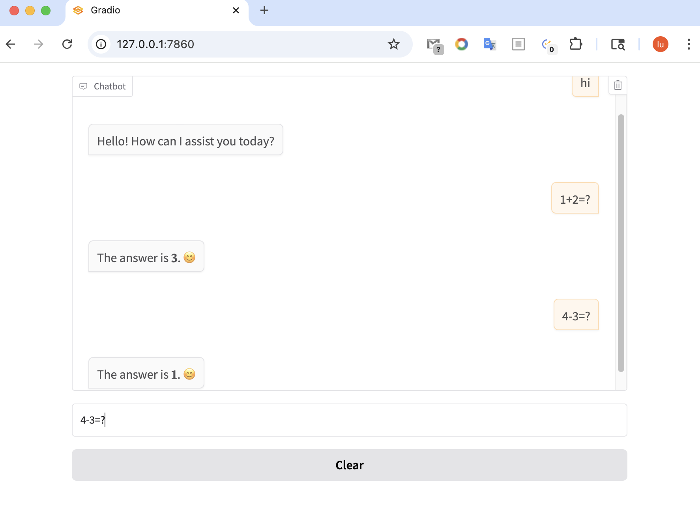

# Prerequisites
- python 3.10 

# Install dependencies
```shell
pip install -e .
```


# Test

## Way 1: Test locally with Claude Desktop by running:
```shell
mcp install server.py
```
after installed successfully, you will see the tools in Claude Desktop, 
and you can send a question like "1+2=?"


## Way 2: Test with  MCP Inspector
```shell
mcp dev server.py
```
after MCP inspector started sucessfully:
- open http://127.0.0.1:6274, 
- refill the Command with "mcp", Arguments with "run server.py",
- then click connect, and test the tools, resources, prompts, etc.


# Chatbot
This chatbot can only support add or sub.
## run
```shell
python chatbot.py
```
After chatbot runsuccessfully, open http://127.0.0.1:7860 to chat like:



# Reference
- [python sdk](https://github.com/modelcontextprotocol/python-sdk)
- [MCP: Build Rich-Context AI Apps with Anthropic](https://www.deeplearning.ai/short-courses/mcp-build-rich-context-ai-apps-with-anthropic/)

